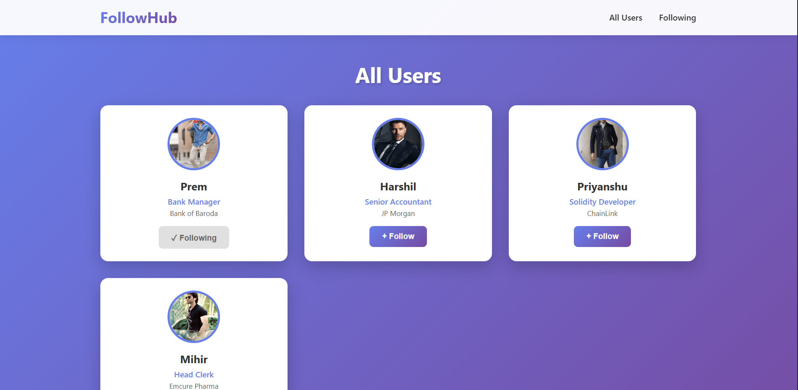
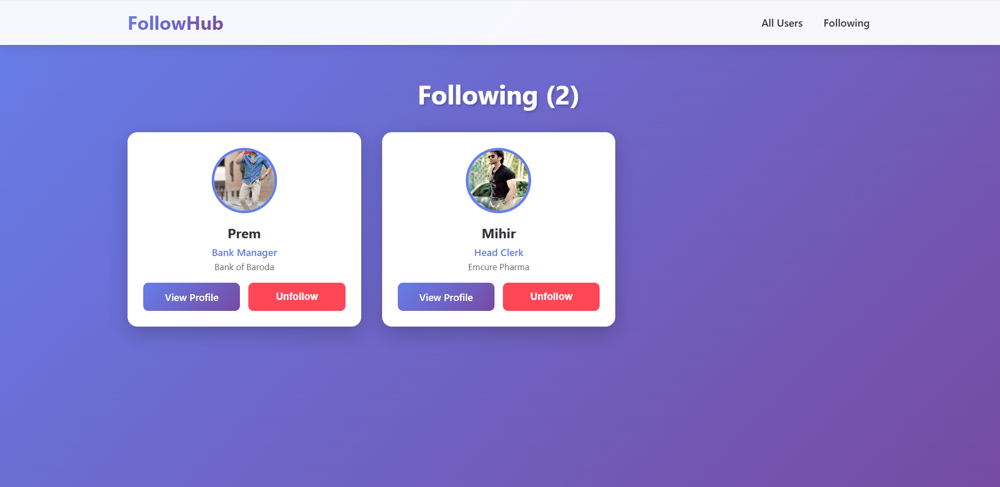

# 👥 FollowHub - User Follow System

A modern React application demonstrating React Router, localStorage persistence, and state management through a user following system.


## 🎯 Project Purpose

This project was built to practice and demonstrate:
- **React Router** - Dynamic routing and navigation
- **useEffect Hook** - Side effects and localStorage synchronization
- **useState Hook** - State management across components
- **localStorage API** - Data persistence between sessions
- **Component-based architecture** - Clean, reusable code structure

## ✨ Features

- **User Discovery** - Browse all available users
- **Follow/Unfollow** - Toggle follow status with one click
- **Following List** - View all users you're following
- **User Profiles** - Detailed profile pages with dynamic routing
- **Data Persistence** - Follows saved to localStorage
- **Responsive Design** - Works on mobile, tablet, and desktop
- **Beautiful UI** - Modern gradient design with smooth animations

## 🚀 Live Demo

[View Live Demo](#) *(Add your deployment link here)*

## 📸 Screenshots

### Home Page


### Following Page


### User Profile


## 🛠️ Tech Stack

- **React** - UI library
- **React Router DOM** - Client-side routing
- **localStorage** - Browser storage API
- **CSS3** - Modern styling with gradients and animations
- **Vite** - Build tool and dev server

## 📦 Installation

1. **Clone the repository**
```bash
git clone https://github.com/yourusername/followhub.git
cd followhub
```

2. **Install dependencies**
```bash
npm install
```

3. **Start development server**
```bash
npm run dev
```

4. **Open in browser**
```
http://localhost:5173
```

## 📁 Project Structure

```
followhub/
├── src/
│   ├── data/
│   │   └── UserData.js          # User data array
│   ├── Pages/
│   │   ├── Home.jsx             # All users page
│   │   ├── Following.jsx        # Following list page
│   │   └── Profile.jsx          # User profile page
│   ├── App.jsx                  # Main app component with routes
│   ├── App.css                  # Global styles
│   └── main.jsx                 # Entry point
├── package.json
└── README.md
```

## 🎓 Key Learning Concepts

### 1. React Router Implementation
```javascript
<Routes>
  <Route path='/' element={<Home/>}/>
  <Route path='/following' element={<Following/>}/>
  <Route path='/following/:userid' element={<Profile/>}/>
</Routes>
```

### 2. localStorage with useEffect
```javascript
// Initialize state from localStorage
const [followingList, setFollowingList] = useState(() => {
  const saved = localStorage.getItem('followinglist');
  return saved ? JSON.parse(saved) : [];
});

// Sync to localStorage on changes
useEffect(() => {
  localStorage.setItem('followinglist', JSON.stringify(followingList));
}, [followingList]);
```

### 3. Dynamic Routing with useParams
```javascript
const { userid } = useParams();
const user = UserData.find(u => u.id === Number(userid));
```

## 🔧 Available Scripts

```bash
npm run dev          # Start development server
npm run build        # Build for production
npm run preview      # Preview production build
npm run lint         # Run ESLint
```

## 🎨 Customization

### Add More Users
Edit `src/data/UserData.js`:
```javascript
export const UserData = [
  {
    id: 5,
    Name: 'Your Name',
    Study: 'Your Degree',
    University: 'Your University',
    Role: 'Your Role',
    Company: 'Your Company',
    Experience: 'X Years',
    Age: XX,
    src: 'image-url'
  }
];
```

### Change Theme Colors
Edit `src/App.css` gradient colors:
```css
background: linear-gradient(135deg, #667eea 0%, #764ba2 100%);
```

## 🐛 Known Issues

- None currently! 🎉

## 🔮 Future Enhancements

- [ ] Add search functionality
- [ ] Add user filtering by role/company
- [ ] Implement Context API for global state
- [ ] Add user authentication
- [ ] Add real backend API integration
- [ ] Add animations and transitions
- [ ] Add dark mode toggle
- [ ] Add user statistics dashboard

## 📝 License

This project is open source and available under the [MIT License](LICENSE).

## 👨‍💻 Author

**Your Name**
- GitHub: [@MilanGadhvi45](https://github.com/milangadhvi45)
- LinkedIn: [MilansinhGadhvi](https://www.linkedin.com/in/milansinh-gadhvi-9a7607332?utm_source=share&utm_campaign=share_via&utm_content=profile&utm_medium=android_app)

##  Acknowledgments

- Built as a learning project for React Router and localStorage

## 📧 Contact

For questions or feedback, please open an issue or reach out at your.email@example.com

---

**⭐ If you found this project helpful, please give it a star!**